# Introduction

The aim of this project is to examine selected factors that may be related to well-being, stress, and productivity. The analysis is based on several datasets that describe different groups of people and different situations, such as student lifestyle, sleep and health, productivity habits, and remote work.

The datasets were not combined into one table, because they do not represent the same population and they do not contain the same variables. Instead, each dataset was analyzed separately. After that, the results were compared in order to identify factors that appear repeatedly across different contexts.

The main focus of the project is on lifestyle and personal condition variables, especially sleep, stress, physical activity, daily habits, productivity, and work-life balance. These factors were chosen because they are commonly connected with mental well-being and performance in everyday life.

Two statistical methods were used in the analysis:

- correlation analysis,
- Principal Component Analysis.

Correlation analysis was used to study direct relationships between the selected target variable and the other numeric variables. Principal Component Analysis was used to study the internal structure of the datasets and to identify the variables that contribute most strongly to the main patterns in the data.

The results should be interpreted as statistical associations. They do not prove that one variable directly causes another one.

# Datasets

The project works with cleaned versions of the original datasets. Each dataset has its own target variable.

| Dataset file | Dataset description | Target variable |
|---|---|---|
| `clean_pca.csv` | General lifestyle and wellness data | `wellness` |
| `clean_productivity.csv` | Productivity and daily habits | `productivity` |
| `clean_sleep.csv` | Sleep and health data | `stress_level` |
| `clean_students.csv` | Student lifestyle data | `stress_numeric` |
| `clean_remote.csv` | Remote work data | `productivity_score` |

The separation of datasets is important. For example, student lifestyle data and remote work data may both contain variables connected with stress or productivity, but the meaning of these variables is not exactly the same. Analyzing them separately gives a cleaner and more reliable interpretation.

# Methods

## Correlation analysis

For every dataset, correlations were calculated between numeric variables and the selected target variable.

A positive correlation means that higher values of one variable are usually connected with higher values of the target variable. A negative correlation means that higher values of one variable are usually connected with lower values of the target variable.

For example, if sleep duration has a positive correlation with wellness, then higher sleep duration is associated with higher wellness values in the dataset. If stress has a negative correlation with wellness, then higher stress is associated with lower wellness values.

Correlation analysis is useful as a first step because it gives a direct overview of the strongest relationships with the target variable. However, it only measures pairwise relationships and does not describe the full structure of the dataset.

## Principal Component Analysis

Principal Component Analysis is a method used to reduce the dimensionality of data. It transforms the original variables into new variables called principal components.

The first principal component, PC1, captures the largest possible amount of variation in the dataset. The second principal component, PC2, captures the largest remaining part of variation, while being independent from PC1. The same idea continues for the following components.

In this project, PCA was used mainly for three purposes:

- to check how much variance is explained by the first components,
- to identify which variables contribute most strongly to PC1,
- to visualize the data in a two-dimensional PCA space using PC1 and PC2.

The explained variance plot shows how much information is contained in each principal component. The PC1 loadings plot shows which original variables are the most important for the main direction of variation. The PC1 vs PC2 plot gives a simplified visual representation of the dataset.

# Dataset 1: Lifestyle and wellness

Target variable: `wellness`

## Correlation with wellness

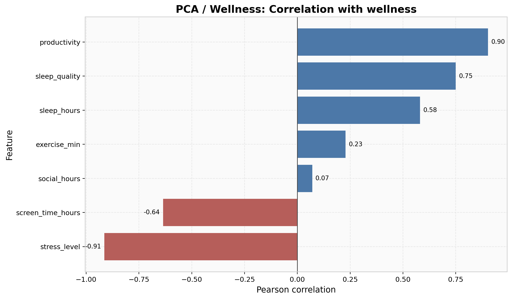

The correlation plot shows how individual lifestyle variables are associated with the wellness score.

Variables with positive correlation values are connected with higher wellness values. Variables with negative correlation values are connected with lower wellness values. The strongest positive and negative correlations are the most important for the first interpretation of the dataset.

This part of the analysis helps identify which lifestyle factors have the clearest direct relationship with well-being.

## PCA explained variance

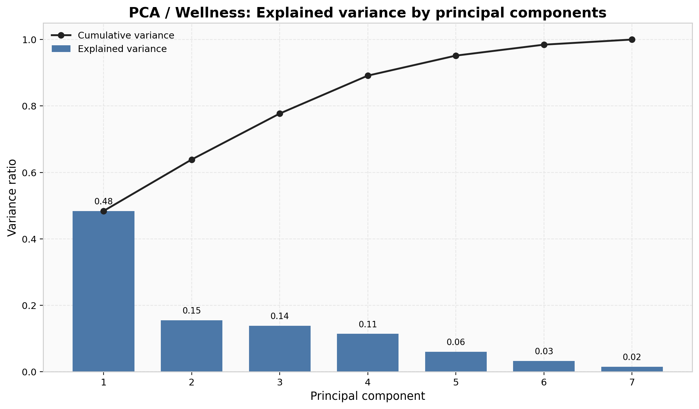

The explained variance plot shows how much variation is captured by each principal component.

If the first few components explain a large part of the total variance, then the dataset has a structure that can be described using fewer dimensions. This is useful because the original dataset may contain several variables, but the main information can often be summarized by a smaller number of components.

## PC1 loadings

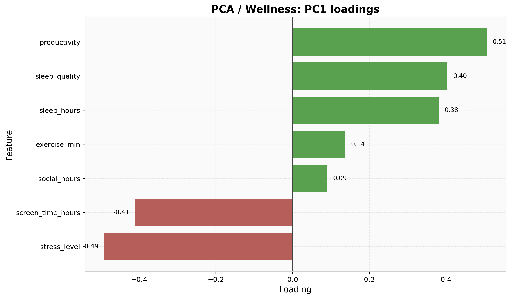

The PC1 loadings plot shows which variables have the strongest influence on the first principal component.

Variables with larger absolute loading values contribute more strongly to PC1. The sign of the loading indicates the direction of the contribution. Variables with the same sign move in a similar direction within the main pattern, while variables with opposite signs move in opposite directions.

This plot is important because PC1 represents the dominant pattern in the lifestyle dataset.

## PC1 vs PC2

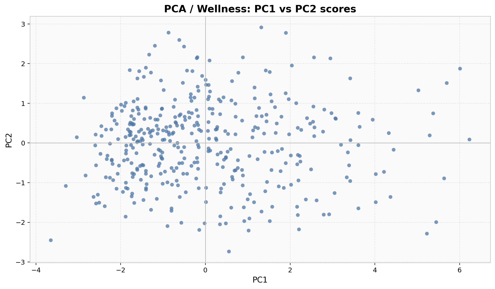

The PC1 vs PC2 plot shows the observations after projection into a two-dimensional PCA space.

Each point represents one observation from the dataset. The horizontal and vertical axes are not original variables, but new PCA components. This plot gives a simplified view of the dataset and may show whether the observations form visible groups, trends, or separated areas.

# Dataset 2: Productivity

Target variable: `productivity`

## Correlation with productivity

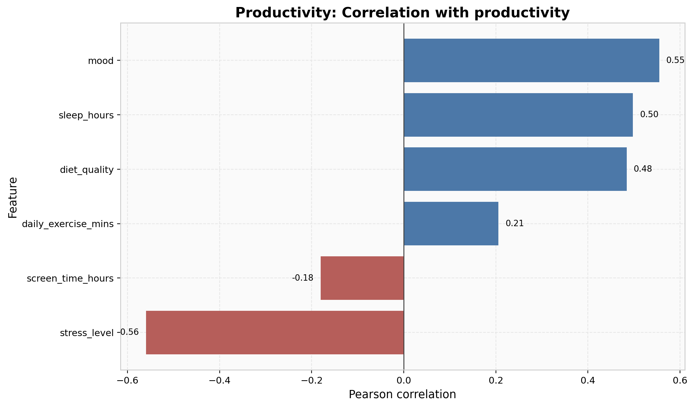

This plot shows the relationship between productivity and the other numeric variables in the productivity dataset.

Positive correlations indicate variables that tend to increase together with productivity. Negative correlations indicate variables that tend to decrease when productivity increases.

The goal of this part is to identify which daily habits or personal factors are most closely connected with productivity.

## PCA explained variance

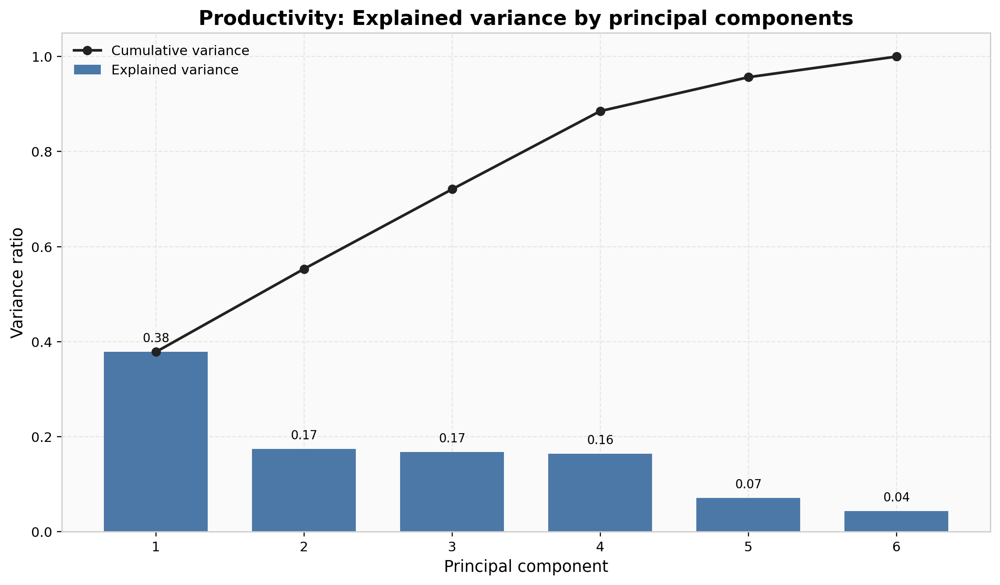

The PCA explained variance plot shows how much of the dataset structure is captured by each principal component.

If the first components explain a noticeable part of the total variance, then productivity-related data can be interpreted through a smaller number of main patterns instead of many separate variables.

## PC1 loadings

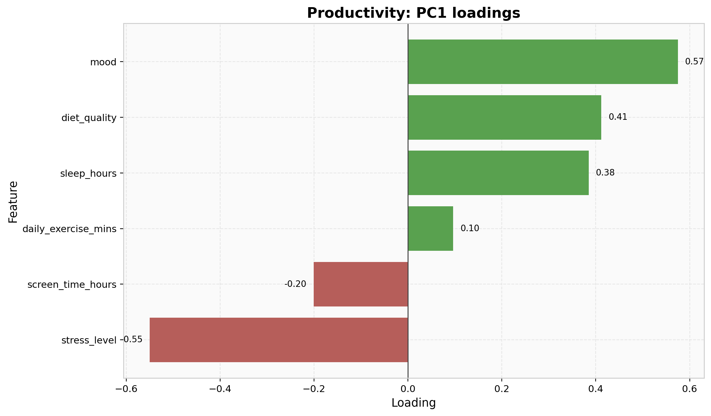

The PC1 loadings plot identifies the variables that define the strongest pattern in the productivity dataset.

If several lifestyle-related variables have strong loadings, this suggests that productivity is not connected with only one isolated factor. It may instead be related to a broader combination of habits and personal conditions.

## PC1 vs PC2

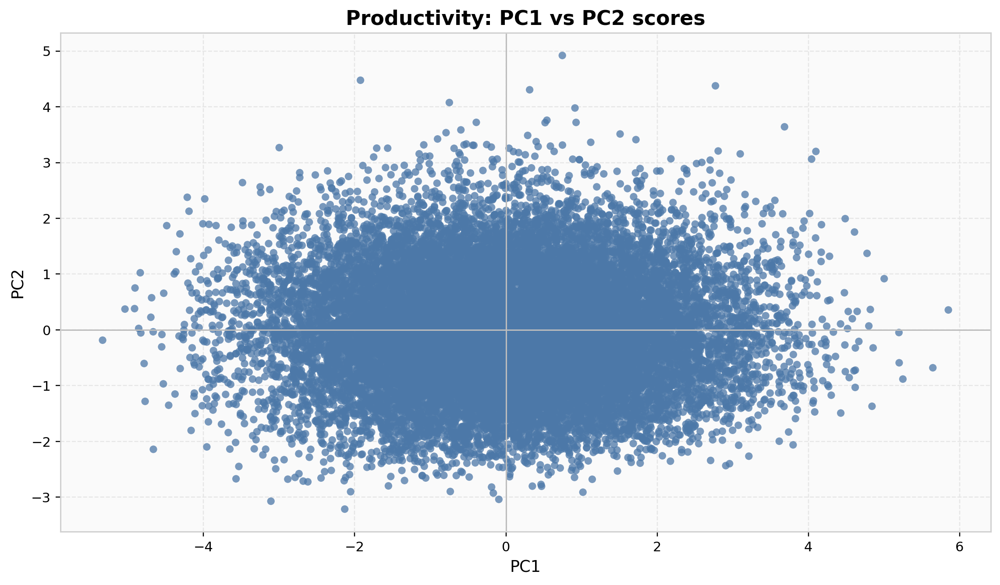

The PC1 vs PC2 plot gives a two-dimensional representation of the productivity dataset.

This visualization is useful for checking whether the dataset has a clear structure after dimensionality reduction. It can also help detect possible groups of observations or unusual points.

# Dataset 3: Sleep and stress

Target variable: `stress_level`

## Correlation with stress level

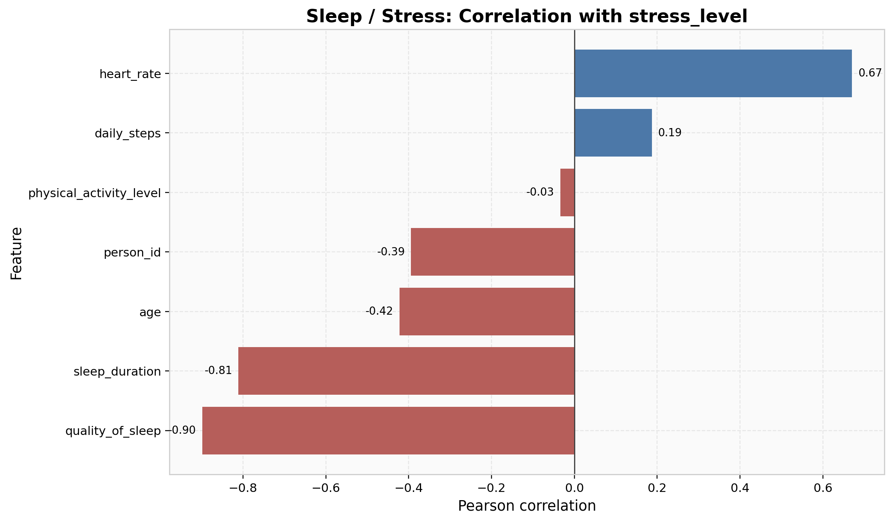

This plot shows which variables are most strongly associated with stress level in the sleep dataset.

Positive correlations mean that higher values of a variable are connected with higher stress levels. Negative correlations mean that higher values of a variable are connected with lower stress levels.

This dataset is especially relevant because sleep and stress are closely related in many real-life situations.

## PCA explained variance

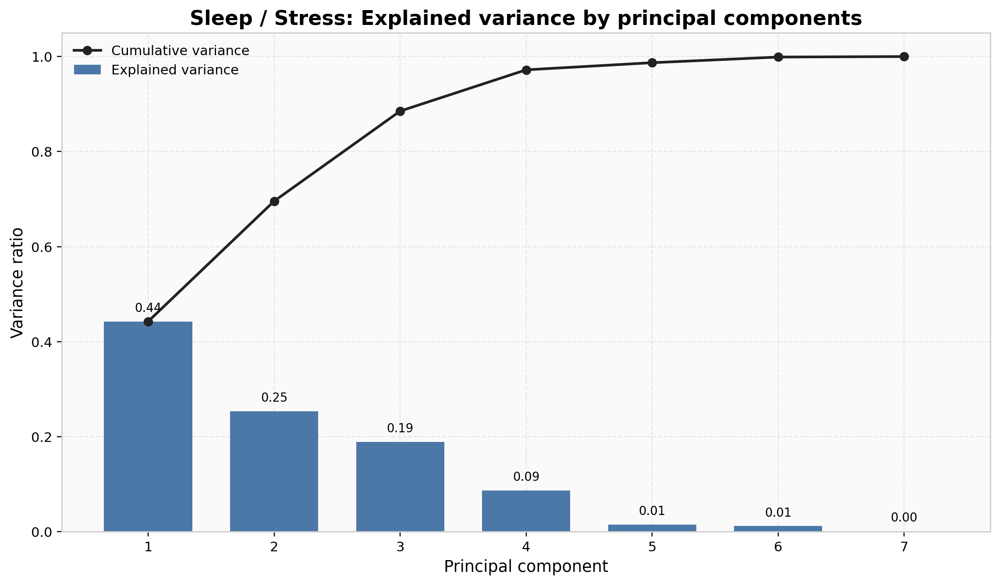

The explained variance plot shows how much of the variation in the sleep dataset is captured by each principal component.

A sharp decrease in explained variance would mean that most of the information is concentrated in the first few components. A slower decrease would suggest that the structure of the data is more spread across several dimensions.

## PC1 loadings

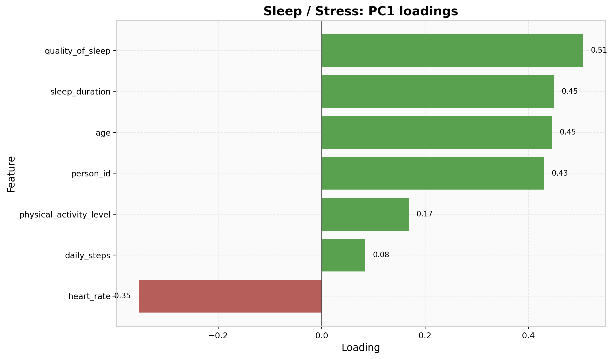

The PC1 loadings plot shows which variables contribute most strongly to the main pattern in the sleep dataset.

This helps interpret whether the dominant pattern is mainly related to sleep duration, physical activity, stress, health indicators, or a combination of several factors.

## PC1 vs PC2

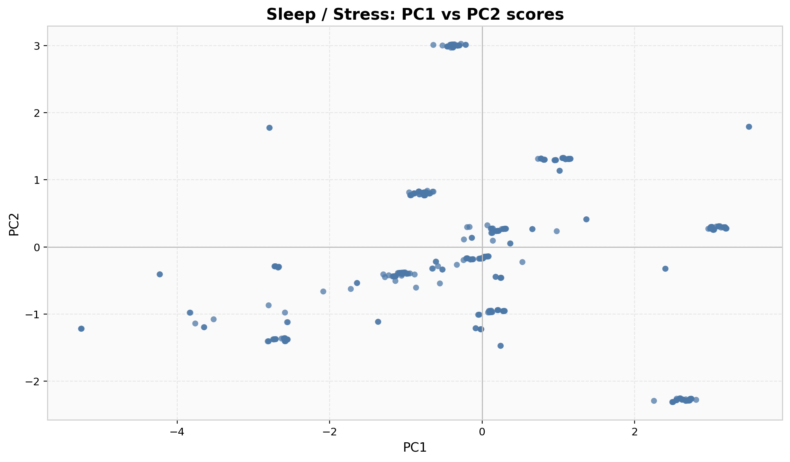

This plot shows the observations in the PCA space formed by PC1 and PC2.

The purpose of this visualization is to give a compact view of the dataset. It may also show whether observations are distributed randomly or whether some structure is visible.

# Dataset 4: Students

Target variable: `stress_numeric`

## Correlation with stress

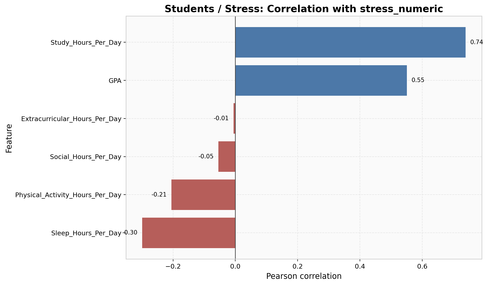

This plot shows how student lifestyle variables are related to stress.

The analysis focuses on variables such as study time, sleep, physical activity, social time, and other factors that may affect a student's stress level.

The strongest correlations are the most important for understanding which parts of student lifestyle are most closely associated with stress in this dataset.

## PCA explained variance

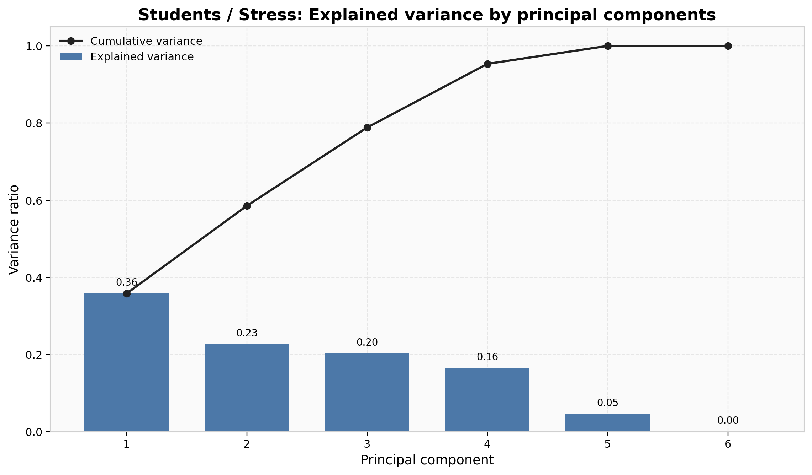

The PCA explained variance plot shows how much information is captured by each principal component.

For student lifestyle data, PCA is useful because stress may depend on several variables at the same time. The explained variance plot shows whether these variables can be summarized by a small number of principal components.

## PC1 loadings

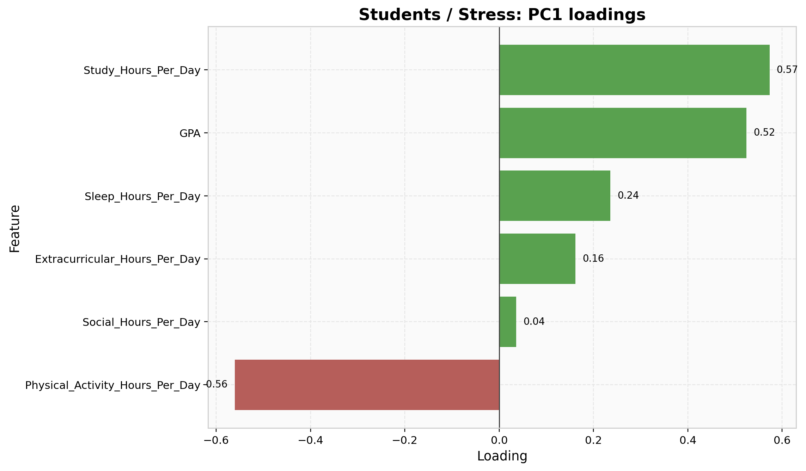

The PC1 loadings plot shows which student-related variables contribute most strongly to the first principal component.

This helps identify the dominant student lifestyle pattern. Depending on the strongest loadings, this pattern may be related to study load, sleep, free time, activity, or stress.

## PC1 vs PC2

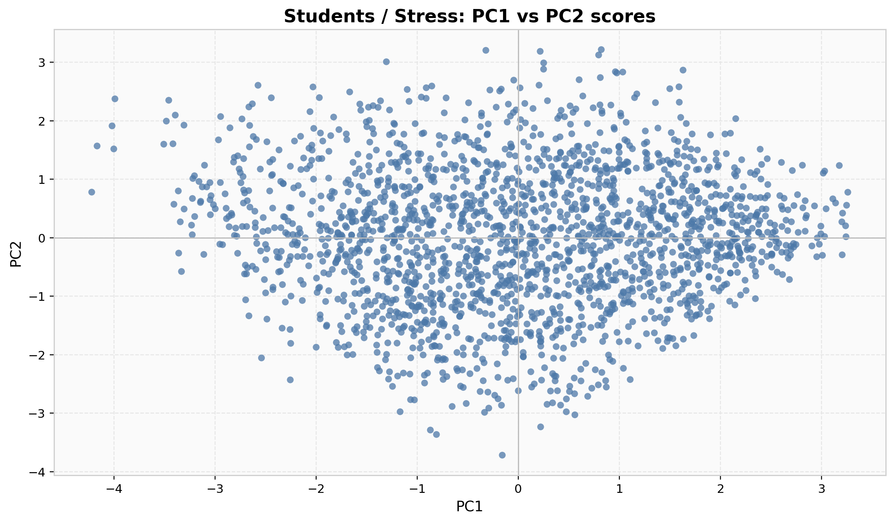

The PC1 vs PC2 plot shows student observations in a reduced two-dimensional space.

This view can help identify whether the dataset contains visible groups or whether the observations are spread continuously without clear separation.

# Dataset 5: Remote work

Target variable: `productivity_score`

## Correlation with productivity

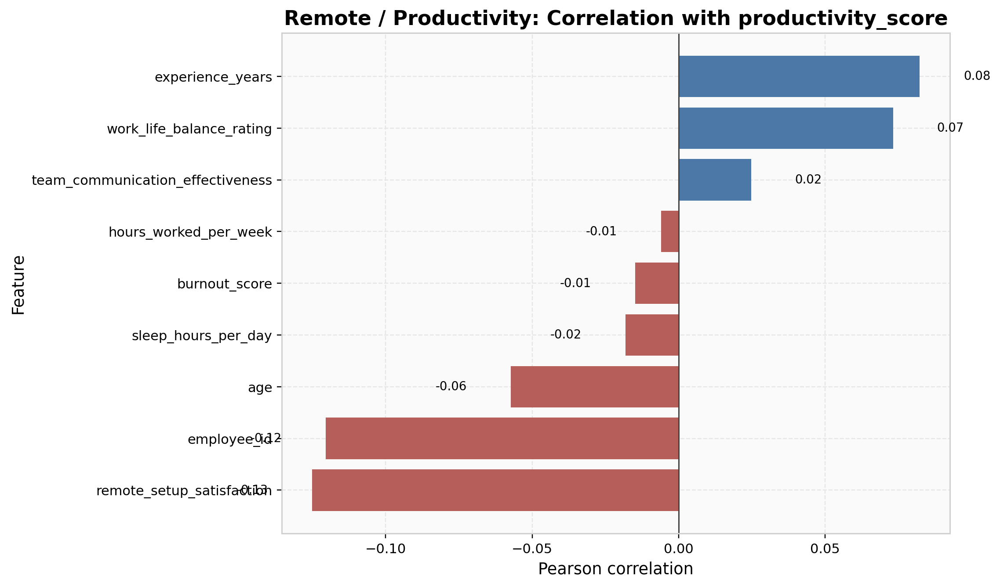

This plot shows how variables from the remote work dataset are associated with productivity score.

The analysis can indicate whether productivity is more strongly related to work-life balance, sleep, work hours, communication, satisfaction, or other remote-work conditions.

## PCA explained variance

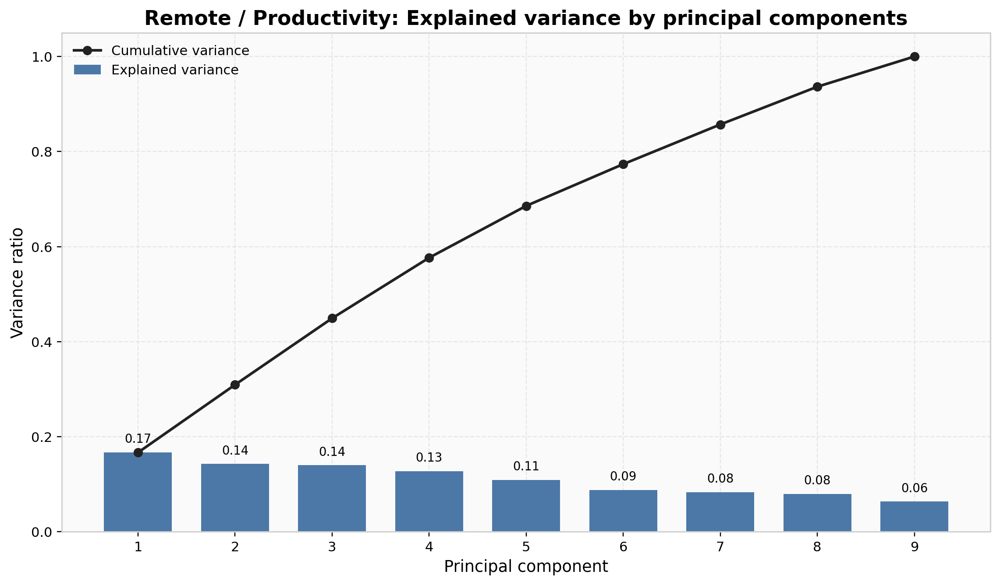

The explained variance plot shows how much of the remote work dataset is represented by each principal component.

This helps evaluate whether the main structure of the dataset is concentrated in the first components or whether it is distributed across many dimensions.

## PC1 loadings

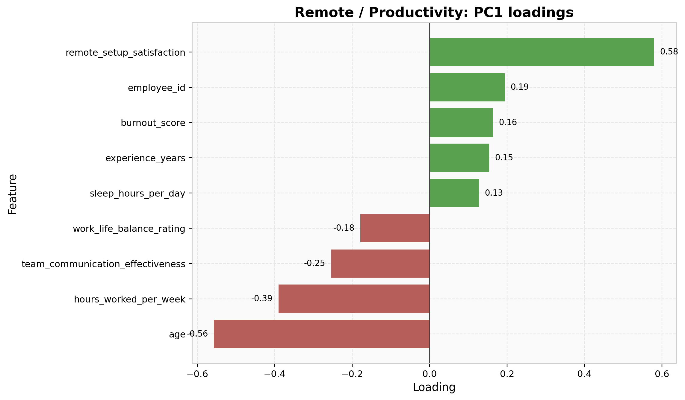

The PC1 loadings plot shows which variables define the strongest pattern in the remote work dataset.

The most influential variables can help interpret whether the main direction of variation is connected with workload, balance, productivity conditions, satisfaction, or another aspect of remote work.

## PC1 vs PC2

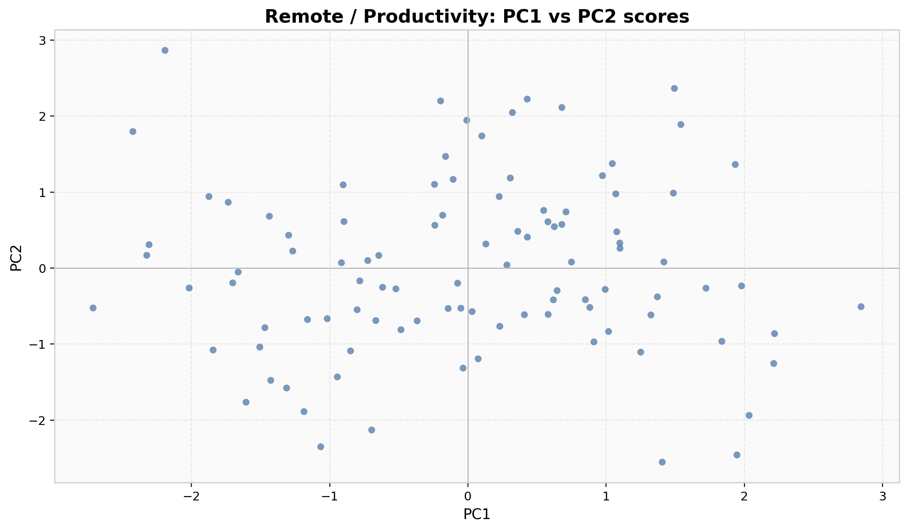

The PC1 vs PC2 plot gives a simplified representation of the remote work data.

This visualization is useful for checking whether the observations form visible groups or whether productivity-related conditions vary gradually across the dataset.

# General comparison

After analyzing all datasets separately, several types of variables appear repeatedly as important:

- stress-related variables,
- sleep-related variables,
- physical activity,
- daily habits,
- productivity-related factors,
- lifestyle or work-life balance.

These factors appear in different datasets and in different contexts. This makes the result more meaningful, because the same general types of variables are connected with well-being, stress, or productivity in more than one source of data.

The comparison also shows why it was useful to analyze the datasets separately. Each dataset has its own target and its own context, but some broader patterns are still repeated.

# Limitations

There are several limitations in this project.

First, the datasets come from different sources. This means that variables may be measured in different ways, and the results cannot be compared perfectly.

Second, the analysis is based mainly on correlation and PCA. These methods are useful for finding relationships and patterns, but they do not prove causality.

Third, some variables may be influenced by external factors that are not included in the datasets. For example, stress or productivity can depend on personal, social, health-related, or environmental conditions that are not always measured.

Because of these limitations, the results should be interpreted as an exploratory analysis rather than a final explanation of well-being or productivity.

# Conclusion

The analysis shows that well-being, stress, and productivity are connected with several recurring groups of variables.

The most important repeated factors are sleep, stress, physical activity, daily habits, and lifestyle or work-life balance. These factors appeared in more than one dataset and were visible either through correlation analysis or PCA.

Correlation analysis helped identify variables that are directly associated with the target variables. PCA provided a broader view of the structure of each dataset and helped identify the variables that form the main patterns.

Overall, the results suggest that human well-being and productivity are not connected with only one variable. They are more likely related to a combination of lifestyle, mental-state, and work-related factors.

# Data sources

The datasets used in this project were taken from Kaggle:

- [Screen Time vs Mental Wellness Survey - 2025](https://www.kaggle.com/datasets/adharshinikumar/screentime-vs-mentalwellness-survey-2025)
- [Sleep Health and Lifestyle Dataset](https://www.kaggle.com/datasets/uom190346a/sleep-health-and-lifestyle-dataset)
- [Mental Health and Productivity Dataset](https://www.kaggle.com/datasets/dewminimnaadi/mental-health-and-productivity-dataset)
- [Student Lifestyle Dataset](https://www.kaggle.com/datasets/steve1215rogg/student-lifestyle-dataset)
- [Mental Health in Tech Survey](https://www.kaggle.com/osmi/mental-health-in-tech-survey/data)
- [Mental Health of Remote Workers](https://www.kaggle.com/datasets/irhsa15/mental)